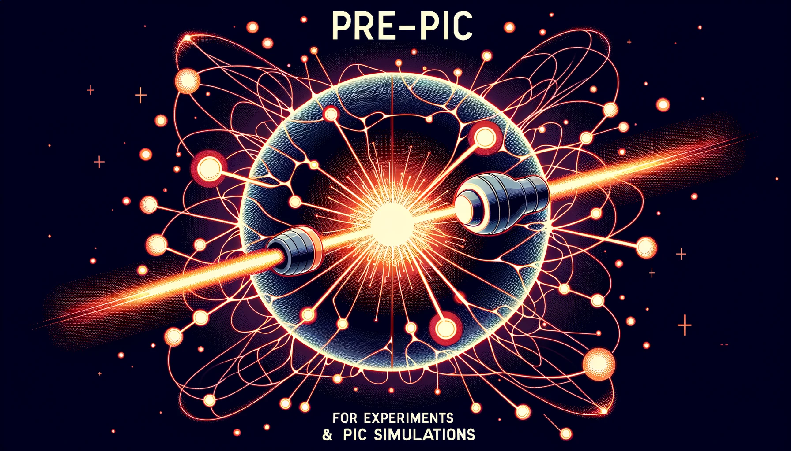

=======
pre-PIC
=======

Analytically estimate various laser-plasma parameters for experiments and PIC simulations

Features
--------

* estimation of accelerated bunch properties (charge, energy, etc.)
* estimation of betatron spectrum
* small codebase, with minimal dependencies
* support for SI units

Quick start
-----------

We make use of the excellent `pixi <https://pixi.sh>`_ package manager, which can be installed on Linux/macOS via::

    $ curl -fsSL https://pixi.sh/install.sh | bash

One can then clone this repo via::

    $ git clone git@github.com:berceanu/prepic.git

Estimate ideal laser-plasma matching parameters based on scaling laws from [LTJT]_

.. [LTJT] Lu, Wei, et al. Physical Review Special Topics-Accelerators and Beams 10.6 (2007): 061301.
